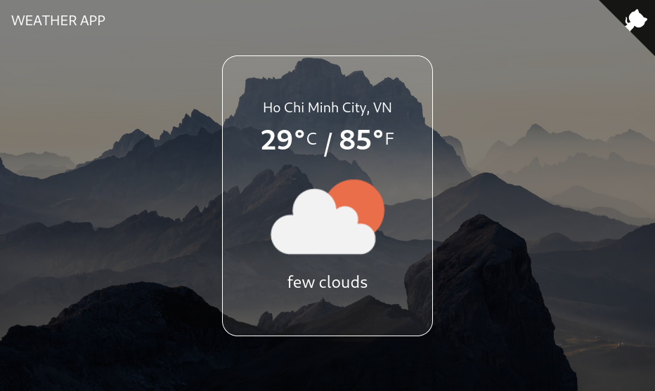
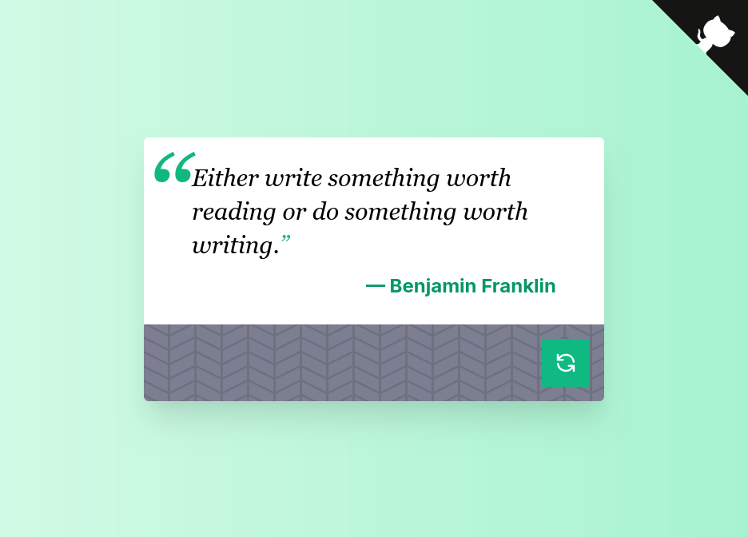
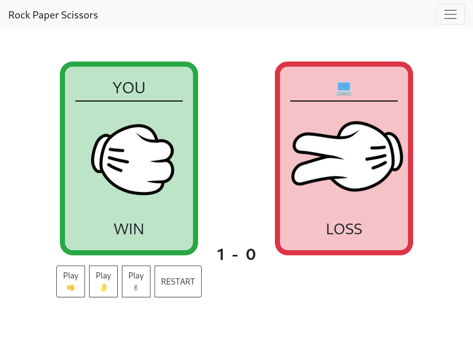
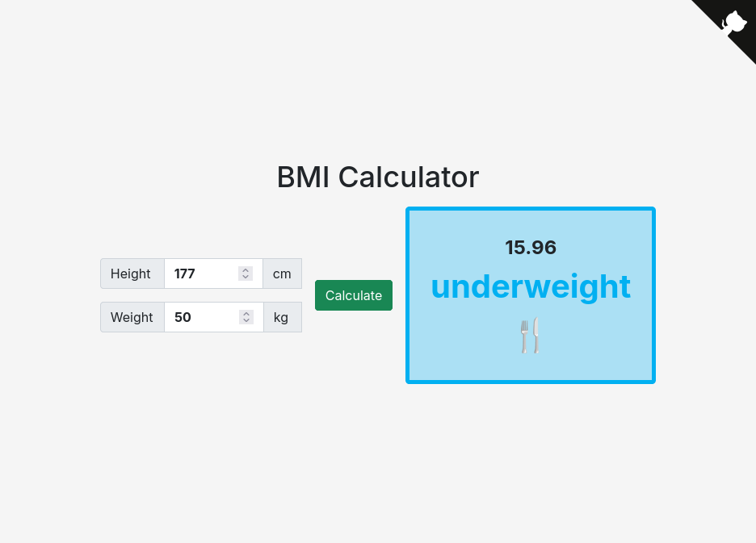
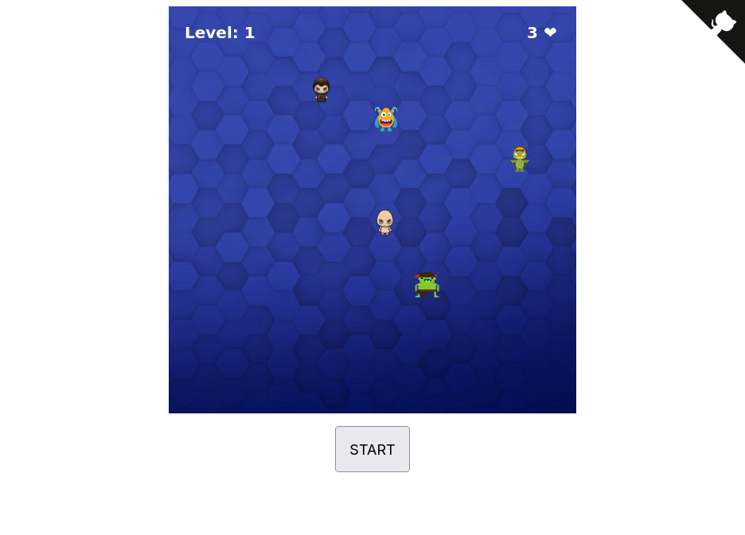

# 👋 Hi, I’m Thắng

I'm

- a **Full Stack Web Developer** (by choice)
- a **[6x AWS Certified](https://www.credly.com/users/lequangthang/) - Cloud Enthusiastic** (by chance)
- a Mechatronics Engineer (by training)

My current stack is Golang, MySQL, React.

I also have many hands-on experience, projects with

- MERN stack (MongoDB, ExpressJS, React, Node) when I went to a boot-camp at CoderSchool;
- Ruby on Rails when I taught myself web development for more than a year.

## 🕹️ Things I've worked on recently

- [_AWSsome_](https://awssome.vercel.app/): Mind-maps for AWS Certificates.

- [_Cantrill's AWS Courses Comparer_](https://cantrill-aws.vercel.app): This helps me get my 4th, 5th and 6th AWS certificates.

- [GTDB](https://gtdb.vercel.app): Be a safe driver 🚲🛵🏍️🚗 (Road signs, road surface markings, driving laws...)

## 🎮 Things I've done for myself but maybe helpful for others

- [Notes about things I learned](https://github.com/lethang7794/notes)
- [My dotfiles](https://github.com/lethang7794/dotfiles)
- [Awesome Web Dev Content](https://github.com/lethang7794/awesome-web-dev-content)
- [Notes for _AWS Certified Solution Architecture - Associate (SAA-C03)_](https://lethang7794.github.io/aws-sa-associate-saac03)
- [Notes for _AWS Certified Developer - Associate (DVA-C02)_](https://lethang7794.github.io/aws-dev-associate)
- [Notes for _Fundamentals of DevOps and Software Delivery_ book](https://lethang7794.github.io/devops-book/)

## ✅ Things I've done a long time ago

If you really want to see, click to expand ...

### **With Ruby on Rails**

- Twitter Clone [(Source Code)](https://github.com/lethang7794/rails_sample_app)

  (No more Demo - Heroku shut down their free tier in 2022 😭)

  

### **With React**

- Muvi - a movie browser - [Demo](https://lqt-movie-browser.netlify.app/)

  

- Github Issue Browser - [Demo](https://lqt-github-issues-browser.netlify.app/)

  

- Weather app - [Demo](https://lqt-weather-app.netlify.app/)

  

- Random Quote Machine - [Demo](https://lqt-quote-machine.netlify.app)

  

- Rock, Paper, Scissors - [Demo](https://lqt-rps.netlify.app/)

  

### **Responsive Design**

- A Technical Documentation Page - [Demo](https://codepen.io/lethang7794/full/dypWXNK)

  

- My (outdated) portfolio - [Demo](https://codepen.io/lethang7794/full/BaLmJWM)

  

- A travel blog - [Demo](https://codepen.io/lethang7794/full/BaLWZbz)

  

- A Product Landing Page - [Demo](https://codepen.io/lethang7794/full/zYKNbmJ)

  

- A Survey Form - [Demo](https://codepen.io/lethang7794/full/YzGNVbd)

  

- A Tribute Page - [Demo](https://codepen.io/lethang7794/full/XWjpbdj)

  

### **With HTML, CSS, Javascript**

- BMI Calculator - [Demo](https://lqt-bmi-calculator.netlify.app/)

  

- Recorder - [Demo](https://lqt-recorder.netlify.app/)

  

- Balder - The hero - A canvas game - [Demo](https://balder-the-hero.netlify.app/)

  

## 📫 Reach me at: <lethang7794@gmail.com>
